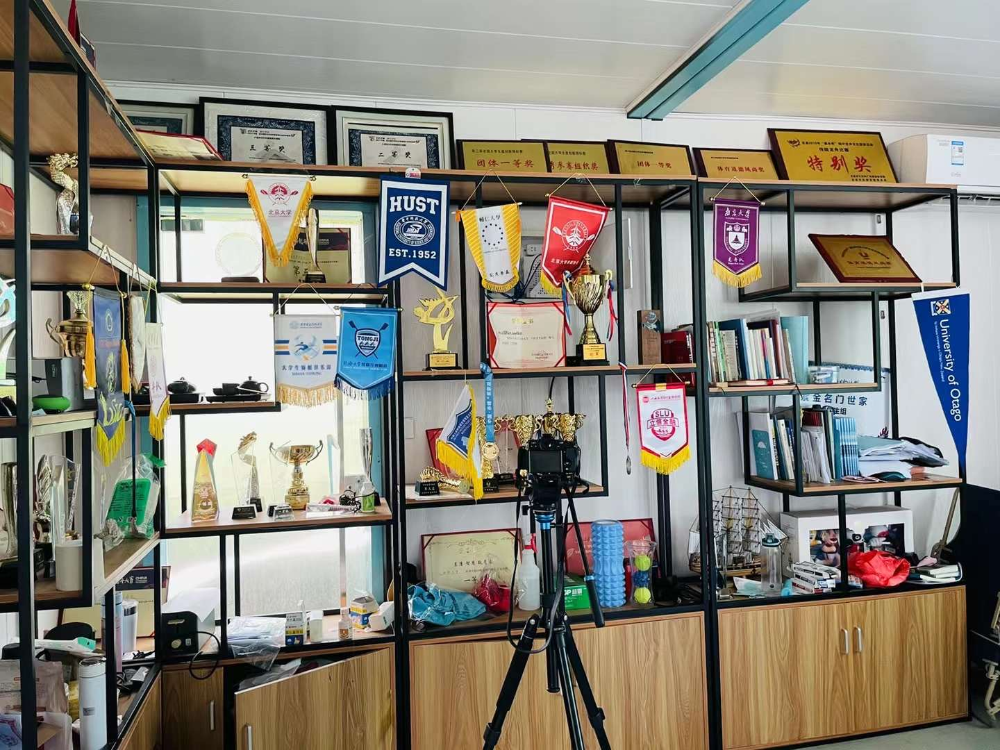

# Welcome!

I'm Shiqi Wu, a Master of Public Health in Epidemiology candidate at Columbia University. With a passion for public health, data science, and epidemiology, I am dedicated to utilizing my skills in data analysis, research, and healthcare to make impactful contributions to the field. Feel free to explore my academic and professional experiences, and connect with me through the links provided.

# Education

**Columbia University, New York, USA**  
Master of Public Health in Epidemiology  
Certificate: Applied Biostatistics and Public Health Data Science  
*September 2022 - May 2024*

- Coursework: Personal Leadership, Healthcare Accounting and Budgeting, Data Science, Application of Epidemiologic Research Methods, Applied Regression

**Zhejiang University, Hangzhou, China**  
Bachelor of Science in Pharmaceutical Sciences  
*Sept. 2018 - June 2022*

- Skills: R, SAS, SPSS, Java, PowerPoint, Excel, Word

# Experiences

My internship experiences have equipped me with a broad spectrum of skills in data analysis, healthcare investment, and consulting. Here's an overview of my professional journey through internships.

**Bassett Health Institute, Data Analyst Intern** 

- Analyzed firearm-related mortality data (NVDRS) at the zip code level, identifying disparities among occupations with a focus on agriculture, forestry, and fishing, while considering the influence of rurality and social vulnerability

- Utilized R programming and geospatial analysis tools to uncover spatial variability and temporal trends in firearm-related deaths, contributing data-driven insights for targeted intervention strategies and policy recommendations

**Simon-Kucher&Partners, Consulting Intern**

-	Conducted comprehensive landscape analysis and market research to inform the development of pricing strategies for new healthcare products and services, ensuring optimal market access and profitability

-	Collaborated with cross-functional teams to create client presentations and reports, utilizing data analysis and visualization techniques to effectively communicate key findings and recommendations

# Relevant Research

Engaging in various research projects has allowed me to apply my academic knowledge to real-world public health challenges. These experiences have been fundamental in shaping my research skills and understanding of epidemiological phenomena.

**Maternal and Infant Outcomes Associated with Antiretroviral Therapy in Pregnancy**

-	Organized literature about ART, pregnancy and birth outcomes and completed systematic review and meta-analysis using R

-	Assessed the heterogeneity and used funnel plots and Egger’s test to check for bias

**Small molecular - Protein Interaction Prediction with Deep learning**   

- Extracted protein information and small molecule information, and helped to build a Transformer model to predict the interaction probability with Convolutional Neural Network and Graph convolution Network

**Faculty Research at Zhejiang University**                               

- Researched retinoic acid-resistant leukemia cells to identify potential targets for drug-resistant acute myeloid leukemia cells

- Cultivated leukemia cell line NB4 and drug-resistant cell line, used Western Blots and flow cytometry to assess silencing efficiency and cell sorting respectively

# Leadership and Activity

- Rowing Team of Zhejiang University, Coxswain and Team Leader for International Competitions

- Public Relations Department, Student Union, College of Pharmacy

